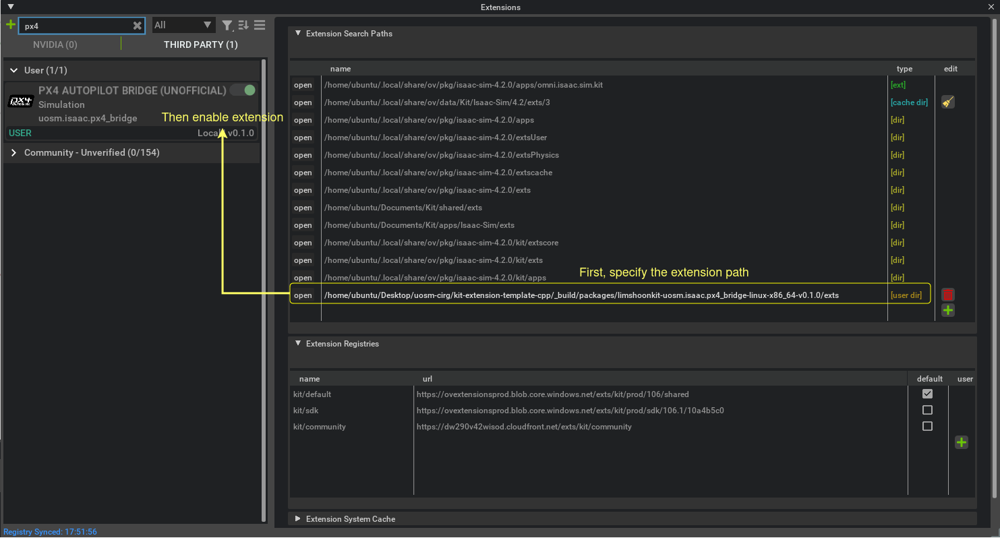
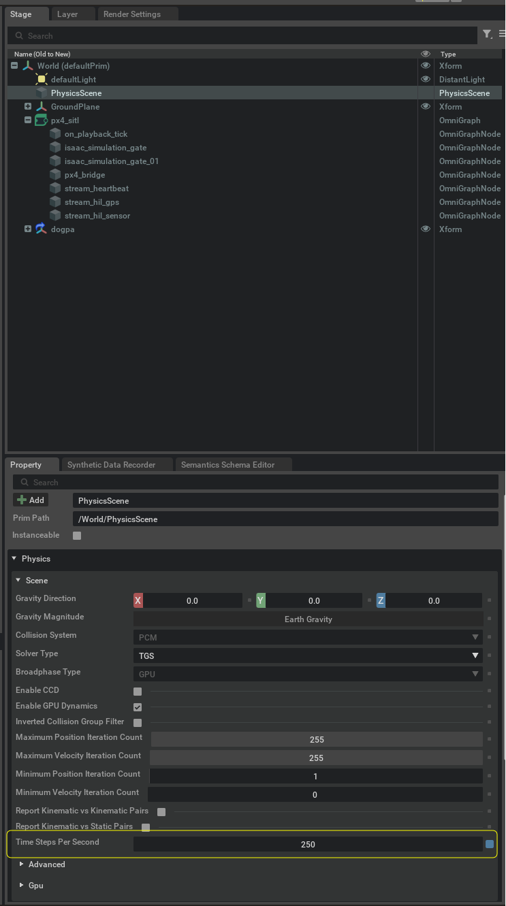
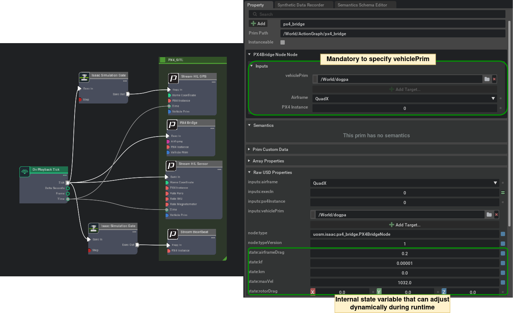
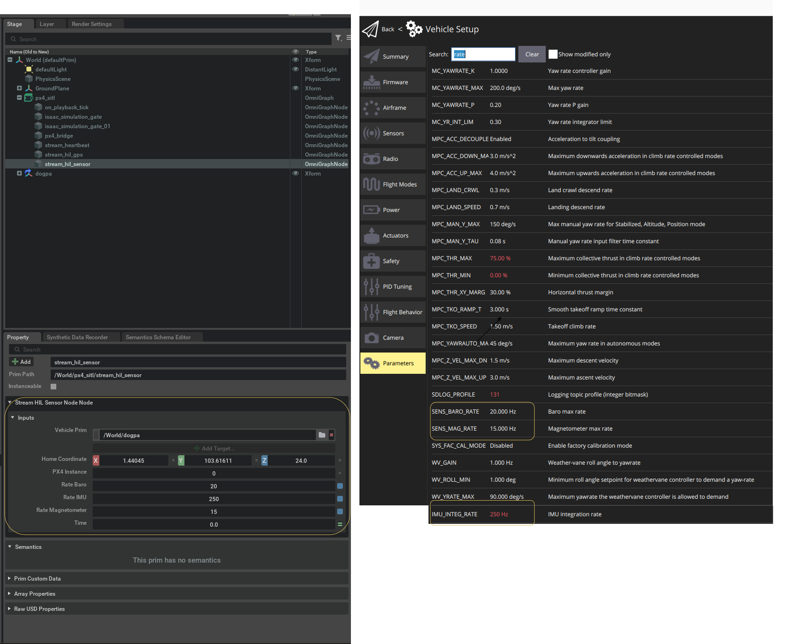
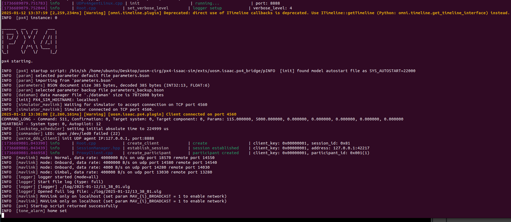
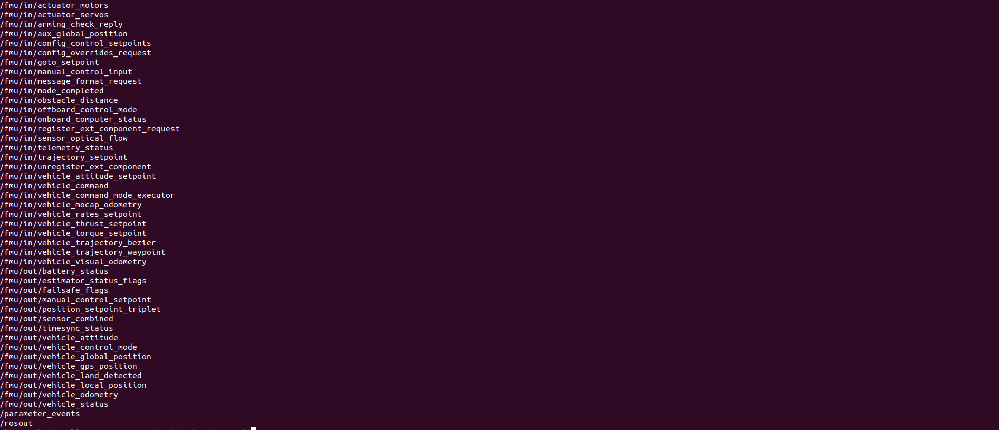

# PX4-Isaac-Sim

Welcome, and thank you for visiting this project!

This tool is developed to aid in sim2real research for aerial robotics by combining **PX4** (v1.15) and **Isaac Sim** (v4.2 / v4.5).

The project has been tested on **Ubuntu 22.04**.

### What You'll Find in This Repository:
1. **C++ Omnigraph Interface**

   A custom [Omnigraph Interface](https://docs.omniverse.nvidia.com/isaacsim/latest/gui_tutorials/tutorial_gui_omnigraph.html) that manages the lifecycle of PX4 SITL (Software In The Loop) simulation. Parameters for vehicle aerodynamics and sensor models, such as rotor constants, drag coefficients, and sensor noise, can be updated dynamically during runtime thorugh the omnigraph attributes panel.

2. **ROS2 Humble Support**

   The integration is achieved using a prebuilt Micro-XRCE-DDS-Agent binary and [px4_msgs](https://github.com/PX4/px4_msgs).

3. **Quadcopter Assets**

   The repository includes `.usd` [model](./model/) for a quadcopter platform based on the Holybro S500 development kit equipped with Nvidia Jetson Orin devices.
   Additionally, it is customizable with various [Sensor Assets](https://docs.omniverse.nvidia.com/isaacsim/latest/features/environment_setup/assets/usd_assets_sensors.html) readily available in Isaac Sim.

---

## Getting Started

1. Download and extract the ZIP folder from the release panel.

2. Launch IsaacSim, navigate to **Window -> Extensions -> Settings**, and add a new Extension search path pointing to the extracted folder.

   <div style="background-color:rgba(192, 192, 192, 0.06); border-left: 4px solid rgba(0, 0, 255, 0.6); padding: 10px;">
   <strong>Note:</strong> This extension is bundled with a pre-built px4_sitl_default (v1.15) and MicroXRCEAgent (v3.0). Users can use their own version by `export PX4_BINARY_PATH={usr-dir-to-px4}` and `export UXRCE_BINARY_PATH={usr-dir-to-MicroXRCEAgent}` in the terminal before launching isaac-sim.
   </div>

   

3. Set up the stage and scene. [Sample quadcopter models](./model) are provided. While the PX4 SITL operates in lockstep mode, the physics timestep should be between 200 and 400, depending on processing power and required physics accuracy. Refer to [Configuring Frame Rate](https://docs.omniverse.nvidia.com/isaacsim/latest/simulation_fundamentals.html#configuring-frame-rate) for more detail. The `Physics Scene Time Steps Per Second` of 200/250 and `Root Layer Time Codes Per Second` of 150/200 is a good inital selection for Synchronous Simulation and Rendering update.

   <div style="background-color:rgba(192, 192, 192, 0.06); border-left: 4px solid rgba(255, 255, 0, 0.6); padding: 10px;">
   <strong>Optional:</strong> While other physics and rendering settings can be kept to its default settings, it is advisable to make some adjustment according to https://docs.omniverse.nvidia.com/isaacsim/latest/reference_material/speedup_cheat_sheet.html
   </div>

   

4. Create the OmniGraph by selecting **Create -> Visual Scripting -> Action Graph** and configuring the nodes as shown. The Omni timeline playback rate will align with the physics rate configured in Step 2.

   

5. For the `Stream_HIL_Sensor` node, adjust the rate of each built-in sensor to match the PX4 parameters. Use the Isaac Simulation Gate to set appropriate rates for other PX4 nodes. For instance:
   - The `Stream_Heartbeat` node requires 1 Hz. If the physics rate is set to 250, set the Isaac Simulation Gate sample rate to 250.
   - The `Stream_HIL_GPS` node requires 10 Hz, so set the Isaac Simulation Gate sample rate to 25.

   <div style="background-color:rgba(192, 192, 192, 0.06); border-left: 4px solid rgba(0, 0, 255, 0.6); padding: 10px;">
   <strong>Note:</strong> Additionally, ensure you specify the target vehicle prim to attach the node. A warning will appear if the vehicle is invalid or not found.  For multi-vehicle setup, duplicate the vehicle and omnigraph nodes and set the appropriate vehicle prim and px4_instance index on the nodes.
   </div>


   

6. Start the simulation by pressing the **SPACEBAR** or clicking the **Play** button in the main toolbar. The vehicle and PX4 state will reset upon stopping the simulation. Check the terminal to monitor the PX4 Autopilot and UXRCE agent running in the background.

   

7. Open another terminal and run the `ros2 topic list` command to view the published `px4_msgs` topics.

   

### Whats next

Follow our other [example](./example/README.md) to setup various SLAM algorithms and offboard ROS control or running in standalone python mode.

---

## License and Disclaimer

This project is released under the [MIT License](./LICENSE).

**Disclaimer:**
The following tools, frameworks, and assets belong to their respective organizations. Please refer to their licenses for usage guidelines:
1. **NVIDIA Omniverse and Isaac Sim**
   [Legal Documentation](https://docs.omniverse.nvidia.com/isaacsim/latest/common/legal.html).
2. **Dronecode and PX4**
   [Dronecode License](https://docs.px4.io/main/en/contribute/licenses.html).

---

## Development Guide

```
# Clone the main repository
git clone https://github.com/NVIDIA-Omniverse/kit-extension-template-cpp.git

# Navigate to the extensions directory
cd kit-extension-template-cpp/source/extensions

# Clone the PX4 Bridge repository
git clone https://github.com/limshoonkit/uosm.isaac.px4_bridge.git

# Initialize submodules
cd uosm.isaac.px4_bridge
git submodule update --init

# Navigate back and build the project
cd ../../../
./build.sh
```

- Note that the initial build may take some time as it downloads the Omniverse Kit SDKs.

- ~~As of writing, the kit-extension-template-cpp is currently on kit 106.5 which is intended for Isaac Sim v4.5 which is yet to be released.~~
For modifications required to use Isaac Sim v4.2, refer to the following: https://github.com/NVIDIA-Omniverse/kit-extension-template-cpp/issues/13.

- The [make script](./premake5.lua) essentially build the Micro-XRCE-DDS-Agent and our custom fork of [PX4-Autopilot](https://github.com/limshoonkit/PX4-Autopilot).
Reference from [PX4 Development Guide](https://docs.px4.io/main/en/dev_setup/dev_env_linux_ubuntu.html) and [eProsima Micro XRCE-DDS](https://micro-xrce-dds.docs.eprosima.com/en/latest/quickstart.html).

```
# Following is required to set the correct runtime path for UXRCE Agent used in the .lua script
sudo apt install patchelf

# readelf -d MicroXRCEAgent

# Dynamic section at offset 0x2d70 contains 30 entries:
#  Tag        Type                         Name/Value
# 0x0000000000000001 (NEEDED)             Shared library: [libmicroxrcedds_agent.so.3.0]
# 0x0000000000000001 (NEEDED)             Shared library: [libstdc++.so.6]
# 0x0000000000000001 (NEEDED)             Shared library: [libc.so.6]
# 0x000000000000001d (RUNPATH)            Library runpath: [$ORIGIN:$ORIGIN/temp_install/fastcdr-2.2.4/lib:$ORIGIN/temp_install/fastdds-3.1/lib:$ORIGIN/temp_install/microcdr-2.0.1/lib]
```

- If there are conflicting Python installations, you may encounter build issues such as https://github.com/PX4/PX4-Autopilot/issues/18413. In such cases, you might need to manually build the px4_sitl target.

- Our PX4 fork includes a new airframe class:
`PX4-Autopilot/ROMFS/px4fmu_common/init.d-posix/airframes/22000_isaacsim_s500`,
designed specifically for our custom model.

To package the extension for release, run the following commands:
```
cd kit-extension-template-cpp
./repo.sh package
```
For more details, refer to https://github.com/NVIDIA-Omniverse/kit-extension-template-cpp

### Roadmap

This project will be maintained until 2027, when Ubuntu 22.04 is being phased out. The Jetson Orin series will be obsolete by 2032.

Maintainer: skl1g14@soton.ac.uk

1. **Nodes for Remaining HIL Messages**

   - Implement HIL_RC_INPUTS_RAW and HIL_OPTICAL_FLOW.
   - Map HIL_RC_INPUTS_RAW to existing gamepad controllers (e.g., PS4/5, Xbox) to enable the creation of a replay buffer for training policies based on expert demonstrations.

2. **Battery Modeling**

   - Incorporate battery discharge characteristics.
   - Integrate thrust dynamics with battery configurations, referencing the [Battery Configuration Guide](https://docs.px4.io/main/en/config/battery.html) and [Thrust Curve Documentation](https://docs.px4.io/main/en/config_mc/pid_tuning_guide_multicopter.html#thrust_curve).

3. **External Disturbance Modeling**

   - Model wind fields and turbulence using the [Forcefield Wind](https://docs.omniverse.nvidia.com/extensions/latest/ext_omnigraph/node-library/nodes/omni-physx-forcefields/omni-physx-forcefields-forcefieldwind-1.html).
   - Simulate the downwash effect, referencing [this paper](https://rpg.ifi.uzh.ch/docs/RAL24_Bauersfeld.pdf).

---

## QnA

1. **Why not use alternatives like Gazebo, Airsim/Colosseum, Carla, Flightmare, Pybullet, Pegasus Sim, Genesis/DiffTaichi?**
   ```
   Pegasus has too many abstractions, making it challenging to adapt to our customized aerial robot model.
   Genesis appears promising, but its performance claims remain doubtful.
   Since we are developing the aerial robot using Nvidia Jetson Orin Series embedded devices, we are tied to the Nvidia developer ecosystem, ruling out other options.
   ```

2. **Is the simulation parallelized?**
   ```
   Scene rendering utilizes the GPU, but the simulation primarily runs on the CPU. Each PX4 SITL instance operates in lockstep and exists as a separate process on the CPU.

   There are no significant benefits to GPU utilization for setups with small number of vehicles (the maximum supported by PX4 SITL is 250, correct me if I am wrong).
   In case if needed, we have to adjust the code base to use computVectorize (https://docs.omniverse.nvidia.com/kit/docs/omni.graph.docs/latest/howto/VectorizedCompute.html#omnigraph-vectorized-compute) instead.
   Profiling on a 12th Gen Intel® Core™ i7-12700H (20 cores) with an RTX 3080 showed consistent performance for up to 5 vehicles, average CPU load is about (19 - 23)ms with basic PX4 bridge node running at physics update rate of 250Hz (Isaac Sim 4.2 Fabric supports up to 400Hz). This does not include other ROS nodes that stream the Camera/RTX Lidar sensor data.
   ```

3. **Can I perform reinforcement learning with this setup?**
   ```
   You can deploy trained policies, as the PX4 SITL interface exposes position, velocity, or low-level actuator inputs via px4_msgs.
   Generally it is not recommended to add any ros or px4 system overhead during training.
   For parallel model-free training (e.g., PPO or SAC), consider workflows provided by [IsaacLab](https://isaac-sim.github.io/IsaacLab/main/index.html) or [Omnidrones](https://omnidrones.readthedocs.io/en/latest/).
   ```

4. **[RTPS_READER_HISTORY Error] Change payload size of '216' bytes is larger than the history payload size of '207' bytes and cannot be resized. -> Function can_change_be_added_nts**
   ```
   This is due to the different msg definition of px4_msgs with our custom fork for PX4-Autopilot. Use https://github.com/Auterion/px4-ros2-interface-lib/blob/main/scripts/check-message-compatibility.py and checkout the proper px4_msgs commit version.
   ```